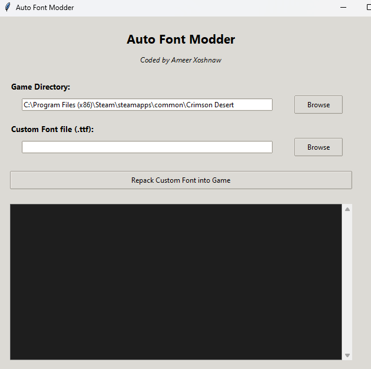

# Auto Font Modder
### Coded by Ameer Xoshnaw

**Auto Font Modder** is a specialized tool for Crimson Desert that allows you to replace game fonts with any custom `.ttf` file. It features high-performance LZ4 calibration and exact size matching to ensure the game doesn't crash or reject the modified archives.

##  Features
- **One-Click Patching**: Automatically replaces both `basefont.ttf` and `basefont_eng.ttf`.
- **Intelligent Calibration**: Uses binary search to find the perfect entropy balance to match original compressed sizes.
- **Smart Trimming**: Automatically handles overly large or padded font files.
- **Steam Path Discovery**: Automatically finds your game install on C: or D: drives.
- **Threaded UI**: Responsive logging during the recalibration process.

##  Usage
1. Make sure you have Python installed with `lz4` and `cryptography` libraries.
2. Run `python FontModGUI.py`.
3. Select your Crimson Desert game folder.
4. Select your custom `.ttf` font.
5. Click **Repack Custom Font into Game**.

## 🛡 Requirements
- Windows OS
- Python 3.9+
- `pip install lz4 cryptography`

---
*Disclaimer: Use at your own risk. This tool modifies game data files.*
